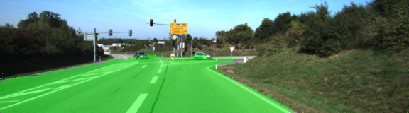
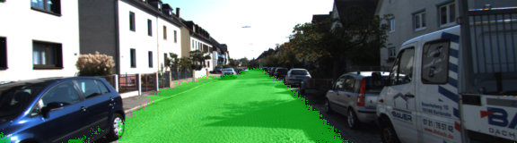

# Semantic Segmentation
### Introduction
In this project, the pixels of a road in images are labeled using a Fully Convolutional Network (FCN). This project is based on the starting repo provided by Udacity.

### Setup
##### GPU
For this project, it will take very long time to run the code without GPU. Because my laptop doesn't have GPU, I used AWS instance to train the neutral network. To setup the AWS instance, I chose an Amazon Machine Image (AMI) "udacity-carnd-advanced-deep-learning".  g3.4xlarge was selected as instance type. 

##### Dataset
Download the [Kitti Road dataset](http://www.cvlibs.net/datasets/kitti/eval_road.php) from [here](http://www.cvlibs.net/download.php?file=data_road.zip).  Extract the dataset in the `data` folder.  This will create the folder `data_road` with all the training a test images.

### Start
##### Implement
The code includes several sections:
1, Download pretrained vgg model and extract layer 3, layer 4 and layer 7.
2, Create the layers for a fully convolutional network.  Build skip-layers using the vgg layers.
3，Define the optimize method using Adam optimizer.
4, Train the network using train_nn. The batch size is 5. Different number of epoches(5, 10, 40) were runned during the trainning. The loss values of each batch for each epoch are stored. 


##### Run the code
Since I selected Amazon Machine Image (AMI) "udacity-carnd-advanced-deep-learning", Python3, Tensorflow, Numpy and Scipy have been installed in the environment. I installed tqdm package using command: pip install tqdm. It is the only package I installed manually.
Before running the code, I logged in the AWS, downloaded the dataset to folder "data" using commands:
curl -O http://kitti.is.tue.mpg.de/kitti/data_road.zip
Then unzip the data file:
unzip data_road.zip

Run the following command to run the project:
```
python main.py
```
#### Results
The last epoch loss mean and standard deviation were:

- 5 Epoch       Average: 0.497986    Std: 0.065264
- 10 Epoch      Average: 0.135962    Std: 0.020502
- 40 Epoch      Average: 0.045999    Std: 0.010584


output images of epoch 40:





